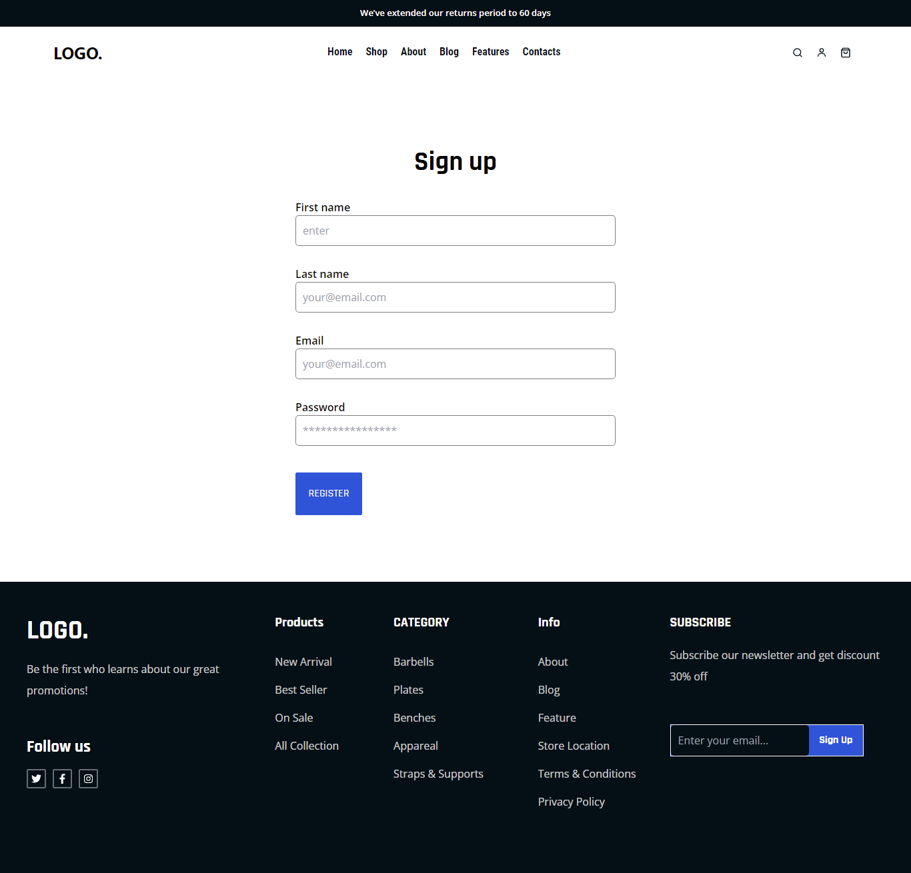

# GYM-Website-2.0

## Overview
This repository contains the source code for **GYM Website 2.0**, a modern and responsive gym website designed to showcase products, services, and facilities of a gym or fitness center. It includes user-friendly interfaces for registration, login, and browsing gym-related products or services.

---

## Features
### General Features
- Modern, clean design tailored for fitness and gym enthusiasts.
- Responsive layout optimized for both desktop and mobile devices.
- Functional components for navigation, announcements, and footer.

### User Capabilities
#### Authentication:
- **Login and Registration:** Secure user login and registration forms.
- **Password Recovery:** "Forget Password" feature for recovering user accounts.

#### Showcase and Navigation:
- **Hero Section:** Attractive landing page with images and essential information.
- **Products Section:** Displays gym-related products with easy navigation.

### Additional Features:
- Announcement bar for special offers and updates.
- Footer with links and resources.

---

## Project Structure
```plaintext
farhanshahriyar-GYM-Website-2.0/
├── public/
│   ├── manifest.json       # Progressive web app manifest
│   ├── index.html          # Entry HTML file
│   ├── robots.txt          # SEO and web crawlers
│   └── _redirects          # Redirect configuration for deployment
├── package.json            # Project dependencies
├── README.md               # Project documentation
├── tailwind.config.js      # TailwindCSS configuration
├── src/
│   ├── index.css           # Global styles
│   ├── components/         # Reusable UI components
│   │   ├── Products/       # Product section
│   │   ├── Register/       # Registration form
│   │   ├── ForgetPas/      # Password recovery
│   │   ├── Login/          # Login form
│   │   ├── Assets/         # Product-related assets
│   │   └── Hero/           # Hero section with images
│   ├── App.js              # Main application component
│   ├── parts/              # Page layout parts
│   │   ├── Header/         # Header component
│   │   ├── Announcement/   # Announcement bar
│   │   ├── Lastpart/       # Ending section
│   │   └── Footer/         # Footer component
│   ├── App.css             # Component-specific styles
│   └── index.js            # Application entry point
```

---

## Installation
1. Clone the repository:
   ```bash
   git clone https://github.com/farhanshahriyar/GYM-Website-2.0.git
   ```
2. Navigate to the project directory:
   ```bash
   cd GYM-Website-2.0
   ```
3. Install dependencies:
   ```bash
   npm install
   ```
4. Start the development server:
   ```bash
   npm start
   ```

---

## Tech Stack
- **Framework:** React
- **Styling:** TailwindCSS
- **State Management:** Context API

---

## Key Files
- **`src/components/`:** Contains reusable UI components.
- **`src/parts/`:** Layout parts like Header, Footer, and Announcements.
- **`src/App.js`:** Core application logic and routing.

---

## Project Screenshot
## Home


## Login | Reg | Forget




## Github

- [@farhanshahriyar](https://github.com/farhanshahriyar)

